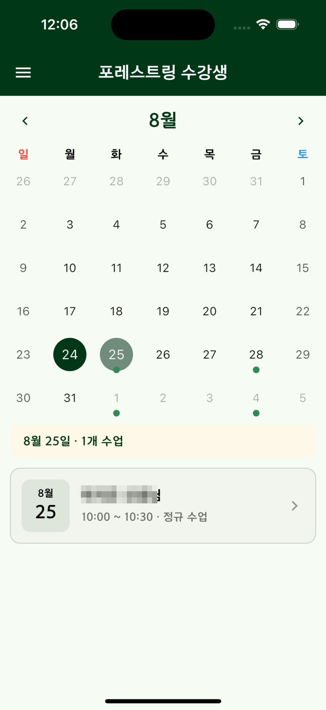
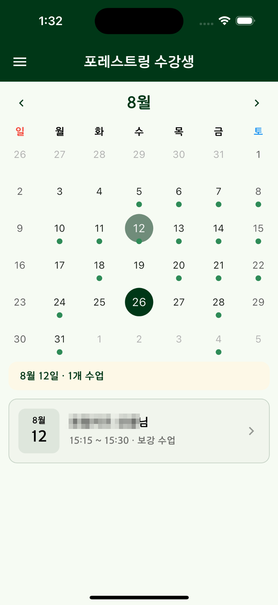
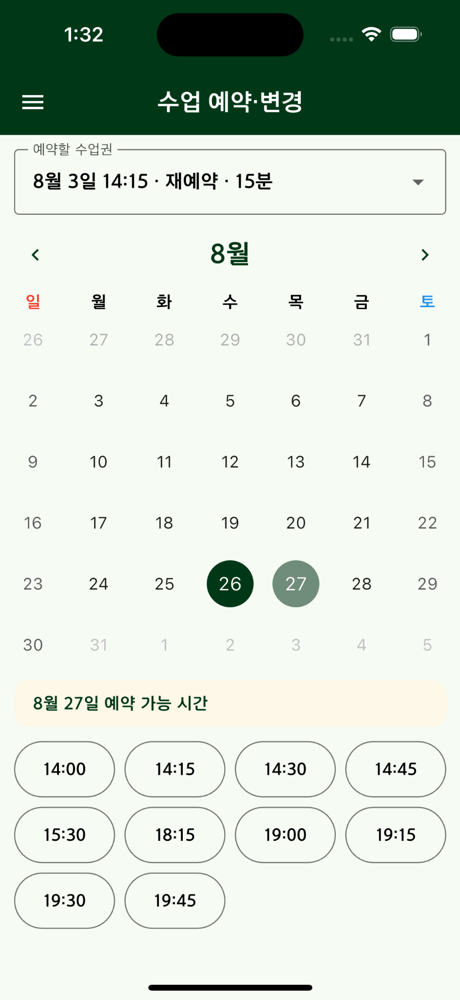
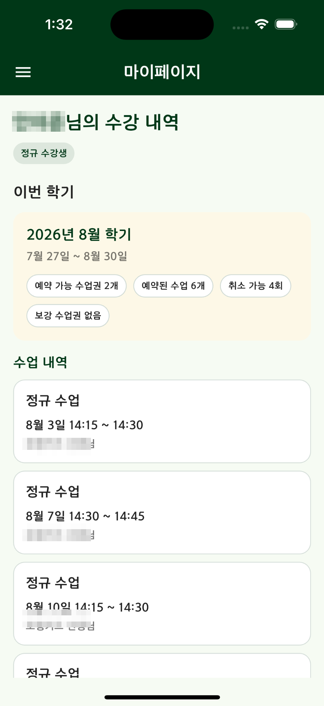
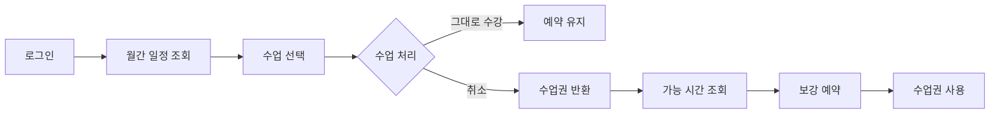
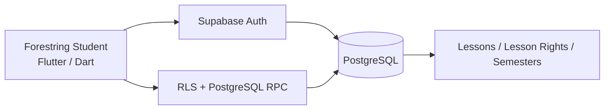

<p align="center">
  
</p>

<h1 align="center">Forestring Student</h1>

<p align="center">
  수강생이 자신의 수업 일정과 취소·보강 흐름을 직접 관리할 수 있도록 만든 <b>Flutter + Supabase 모바일 앱</b>
</p>

<p align="center">
  <a href="https://github.com/B-Dandelion/Forestring_teach">Teacher App</a>
  ·
  Current release: <code>v3.0.1</code>
</p>

---

## Overview

Forestring Student는 학원 수강생이 자신의 수업 일정을 확인하고, 정해진 규칙 안에서 수업을 취소하거나 반환된 수업권으로 보강 일정을 다시 예약할 수 있도록 만든 앱입니다.

Teacher App과 동일한 Supabase 데이터를 사용하며, 수강생에게 필요한 기능만 분리해 모바일 환경에서 빠르게 확인하고 처리할 수 있도록 구성했습니다.

## Key Features

- 수강생 로그인
- 월간 수업 일정 조회
- 수업 상세 확인
- 취소 가능한 수업의 직접 취소
- 취소 후 반환된 수업권 확인
- 반환 수업권을 이용한 보강 일정 재예약
- 학기별 수업 이력 조회
- 마이페이지 및 사용자 정보 확인

## Screenshots

<p align="center">
  
  
  
</p>

<p align="center">
  <b>정규 수업 일정</b> · <b>보강 수업 일정</b> · <b>수업 재예약</b>
</p>

<p align="center">
  
</p>

<p align="center">
  <b>학기별 수강 내역</b>
</p>

## Main Flow



수업 취소와 보강을 서로 독립된 일정으로 처리하지 않고, Teacher App과 동일한 수업권 상태를 공유해 한 번 반환된 권리가 다시 사용되는 과정을 서버에서 추적할 수 있도록 했습니다.

## Architecture



일정 변경 규칙과 권한 검증은 클라이언트 UI에만 의존하지 않고, Supabase RLS와 PostgreSQL RPC를 통해 서버 측에서도 검증하도록 구성했습니다.

## Engineering Highlights

### 1. Shared Domain with Teacher App

학생 앱과 선생님 앱이 각각 별도 일정 데이터를 갖지 않고 동일한 Supabase 스키마를 사용합니다. 선생님이 변경한 수업은 학생 앱에 반영되고, 학생이 취소·재예약한 결과 역시 운영 앱에서 같은 데이터로 확인할 수 있도록 구성했습니다.

### 2. Server-validated Cancellation & Rebooking

수업 취소 가능 여부, 반환 수업권, 재예약 처리처럼 데이터 정합성이 중요한 흐름은 Repository를 통해 서버 RPC를 호출하는 방식으로 구현했습니다.

이를 통해 다음과 같은 문제를 줄이는 것을 목표로 했습니다.

- 동일 수업권의 중복 사용
- 취소 상태와 보강 상태의 불일치
- 권한이 없는 사용자의 일정 변경
- 클라이언트 상태와 DB 상태의 차이

### 3. Firebase Dependency Removal

기존 Firebase 기반 학생 앱을 Supabase 구조로 이전하면서 Firestore 직접 접근과 Firebase 설정 의존성을 제거하고, 인증과 수업 데이터를 Teacher App과 같은 백엔드로 통합했습니다.

## Tech Stack

| Area | Stack |
| --- | --- |
| Mobile | Flutter, Dart |
| State Management | Provider |
| Backend | Supabase |
| Database | PostgreSQL |
| Auth / Security | Supabase Auth, RLS, RPC |
| Calendar | TableCalendar |
| Deployment | Android, iOS |

## Project Structure

```text
lib/
├── app/
├── core/
├── features/
│   ├── auth/
│   └── lessons/
└── main.dart
```

기능 단위로 인증과 수업 도메인을 분리하고, 화면 코드와 데이터 접근 코드를 나눠 관리하고 있습니다.

## Run Locally

운영 환경 값은 저장소에 포함하지 않습니다. `env/example.json`을 참고해 로컬 환경 파일을 구성한 뒤 실행합니다.

```bash
flutter pub get
flutter analyze
flutter run --dart-define-from-file=env/dev.json
```

릴리즈 빌드 예시:

```bash
flutter build appbundle --release --dart-define-from-file=env/dev.json
flutter build ipa --release --dart-define-from-file=env/dev.json
```

## Related Project

- [Forestring Teacher](https://github.com/B-Dandelion/Forestring_teach) — 선생님 / 지점장 / 마스터용 수업 운영·관리 앱 및 Supabase 백엔드

## Notes

- 기본 브랜치 `main`은 현재 운영 기준 코드입니다.
- 과거 Firebase 구현과 주요 릴리즈 시점은 Git tag로 보존하고 있습니다.
- 실제 운영 계정, 개인정보, 비밀키 및 운영용 환경 값은 저장소에 포함하지 않습니다.
